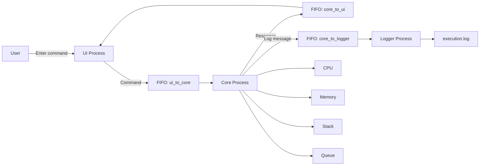

# 3-Process OS Simulator

## Overview

This project is a multi-process Operating Systems simulator consisting of three independent processes:

- **UI Process** – accepts commands from the user
- **Core Process** – processes commands and simulates CPU, Memory, Stack and Queue
- **Logger Process** – records executed commands and results

The processes communicate using **POSIX Named Pipes (FIFO)**.

---

## Team Roles

| Member | Role |
|---|---|
| Haneena | UI Process |
| Ayman | Core Process |
| Vishnu | Logger Process |
| Isha | Team Leader / Integration |

---
## Architecture




---

Communication Flow
1. The user enters a command through the UI Process.
2. UI sends the command to the Core Process using ui_to_core.
3. Core processes the command.
4. Core sends the result back to UI using core_to_ui.
5. Core sends a log message to Logger using core_to_logger.
6. Logger records the activity in execution.log.

IPC Mechanism
The project uses POSIX Named Pipes (FIFO) for Inter-Process Communication.
FIFO Channels
FIFO	Communication
ui_to_core	UI → Core
core_to_ui	Core → UI
core_to_logger	Core → Logger


Named Pipes were selected because they provide a simple and direct way for independent processes to exchange data on Linux.

Core Process
The Core Process simulates basic operating-system components:
- CPU
- Memory
- Stack
- Queue
It receives commands from the UI, executes the corresponding operation and sends a response back.
Supported Commands

start
status
stop
exit

Example
Enter command: status

[CORE RESPONSE] CPU: RUNNING | Memory: ACTIVE | Stack: ACTIVE | Queue: ACTIVE

Logger Process
The Logger Process receives messages from the Core Process through the core_to_logger FIFO.
It displays log messages and stores them in:
execution.log

The log contains information about commands executed by the Core Process.


## Project Structure

```text
3-process-os-simulator/
│
├── ui/
│   └── ui.c
│
├── core/
│   └── core.c
│
├── logger/
│   └── logger.c
│
├── fifos/
│   └── .gitkeep
│
├── benchmark/
│   ├── benchmark.c
│   └── standalone.c
│
├── docs/
│   ├── IPC_Justification.md
│   ├── IPC_Test_Cases.md
│   └── Benchmark_Results.md
│
├── launcher.c
├── Makefile
├── benchmark.sh
├── simulator.log
├── .gitignore
└── README.md
```

## Compilation

The project can be compiled using the Makefile:

```bash
make
```

To remove compiled files:

```bash
make clean
```

Creating the FIFOs
The required FIFO files can be created using:
mkfifo fifos/ui_to_core
mkfifo fifos/core_to_ui
mkfifo fifos/core_to_logger

The FIFOs are runtime communication channels and are not stored as normal source files in GitHub.

## Running the Simulator

### Using Launcher

The simulator can be started using the launcher:

```bash
./launcher
```

The launcher starts the UI, Core and Logger processes.

### Manual Execution

The processes can also be started manually.

Start the Logger Process first:

```bash
./logger/logger
```

Then start the Core Process:

```bash
./core/core
```

Finally start the UI Process:

```bash
./ui/ui
```

Enter commands at the UI prompt:

```text
start
status
stop
exit
```

Example Output
```UI Process
Enter command: start
[CORE RESPONSE] CPU execution started.

Enter command: status
[CORE RESPONSE] CPU: RUNNING | Memory: ACTIVE | Stack: ACTIVE | Queue: ACTIVE

Enter command: stop
[CORE RESPONSE] CPU execution stopped.
```

```Logger Process
[LOGGER] Core executed command: start
[LOGGER] Core executed command: status
[LOGGER] Core executed command: stop
```

Benchmark
A benchmark program is included to measure execution time.
The benchmark performs a computational workload and measures the CPU execution time.
Baseline Benchmark Result
```
Execution time: 0.339687 seconds
```
The benchmark is used as a baseline for performance analysis.
A comparison between standalone and multi-process execution will be recorded as part of the performance evaluation.
Testing

The following IPC test cases are considered:

---
| Test Case | Input | Expected Result |
|---|---|---|
| TC01 | `start` | Core starts CPU execution |
| TC02 | `status` | CPU, Memory, Stack and Queue status displayed |
| TC03 | `stop` | Core stops CPU execution |
| TC04 | `exit` | Processes shut down correctly |
| TC05 | Invalid command | Core returns `Unknown command.` |
| TC06 | Logging | Core command is received by Logger |
---

GitHub / Integration
The Team Leader integrates the independently developed UI, Core and Logger processes and verifies communication between them.
The integration includes:
- UI → Core communication
- Core → UI response
- Core → Logger communication
- FIFO creation
- Process testing
- Benchmarking
- Documentation

  Conclusion
The project demonstrates a three-process operating-system simulator using POSIX Named Pipes for Inter-Process Communication.
The final system separates the user interface, core simulation and logging functionality into independent processes while allowing them to communicate through FIFO channels.

